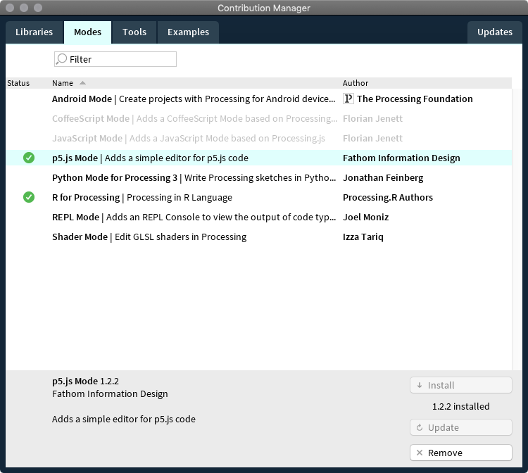
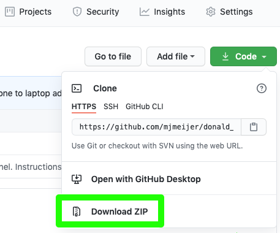
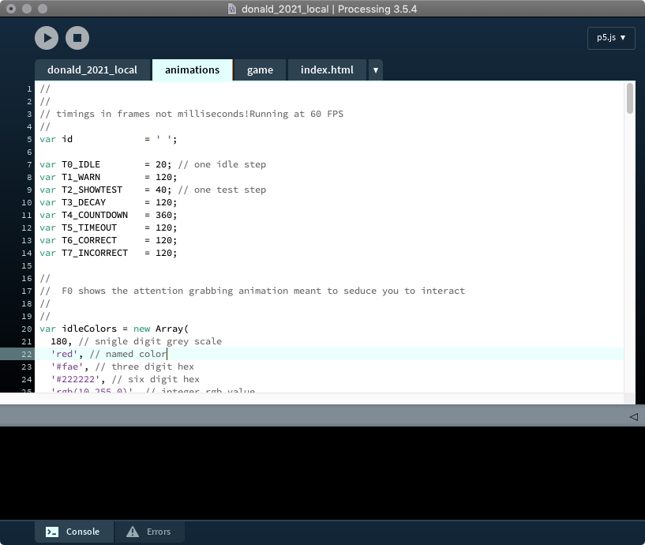
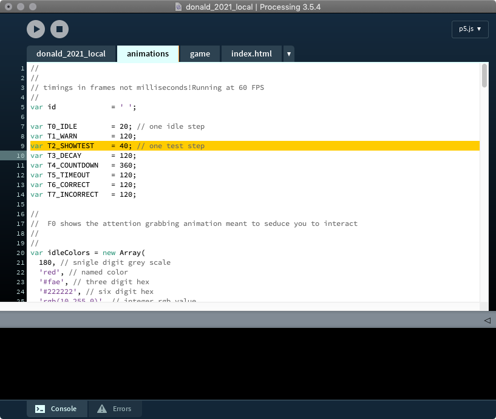
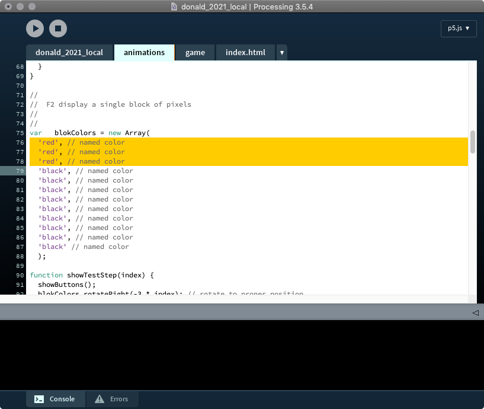
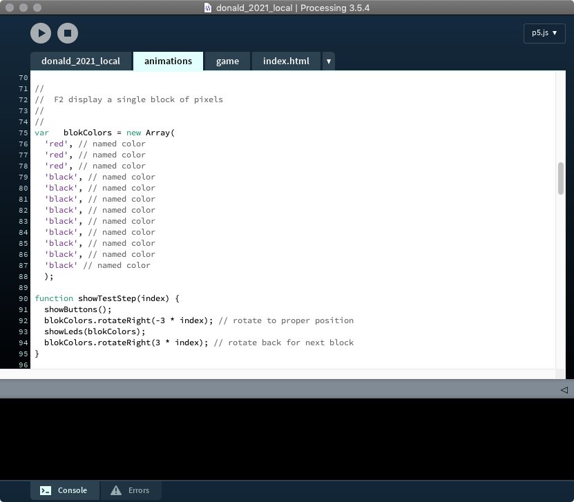
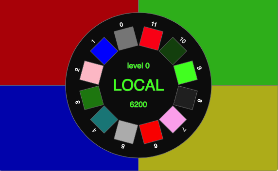
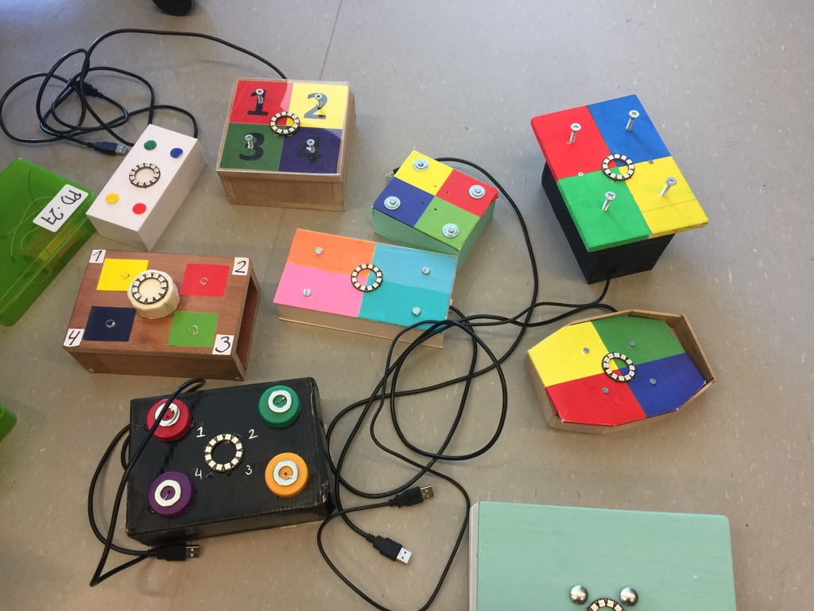
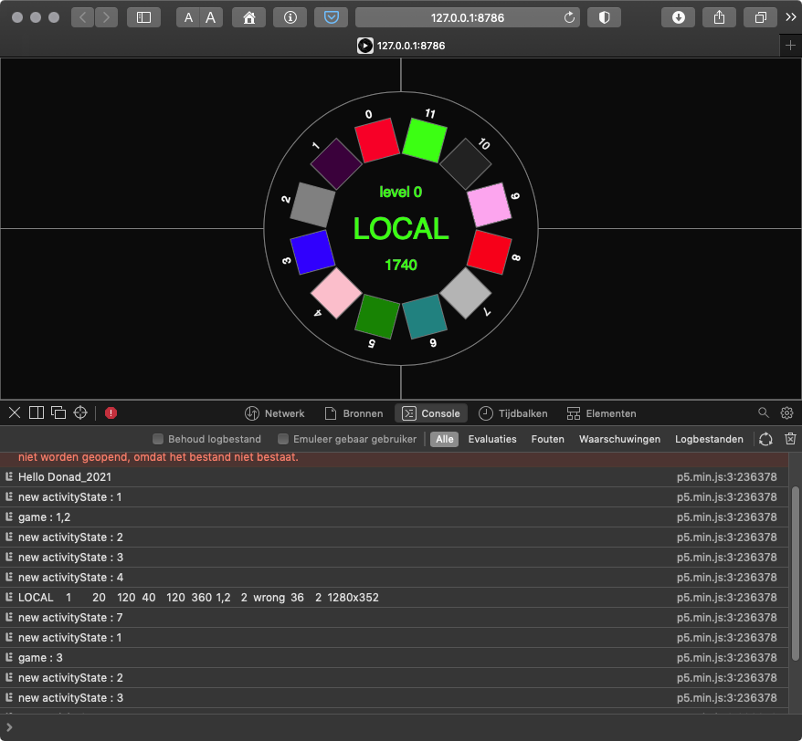

# DONALD 2021 LOCAL

&copy; 2021 Maarten Meijer / AUAS

## Introduction

For a full description see [Full Donald 2021 on Github](https://github.com/mjmeijer/donald_2021).

This repo is the local version used by students to change and develop their own animations.

## Instructions

 - Download and install [Processing](https://processing.org). If you don't know how, look at [this tutorial video up until 3:00](https://youtu.be/w7C3kgRIlW8)

 - Run it.


 - Install the **p5js** environment. More information on [p5js here](https://p5js.org)

 

 - Download the code in a ZIP file by pressing the green Code button top right of this page.

 

 - extract the ZIP file so you see a folder `donald_2021_local`.

 - From the `Processing` `File` menu `Open` the file `donald_2021_local/donald_2021_local/donald_2021_local.js`

 - Click on the tab called `animations.js`

 

 - select the tab `animations.js`

## How to change the code?

  - First look at the instructions on [p5js.org](https://p5js.org/learn/) and understand how p5js works.

  - You can also look at the [CODE! Youtube](https://youtube.com/playlist?list=PLRqwX-V7Uu6Zy51Q-x9tMWIv9cueOFTFA) playlist. Importiant videos are 1.4: Color 2.1: en 2.2: Variables 3.1: Conditional statements and beyond.

  - Only **after** that do you start changing the local code in `animations.js`.

  - Start by changing one of the `Tx_xxxx` timing parameters in the top of the file and press run (>). For example change `T3_SHOWTEST` to `5`. See what happened (_it went too fast!_).If you don't like the effect, just `Undo` your changes. _Changing the timings is changing the user interaction and usability_.

  

  - Next change some of the colors using color names or RGB values.   Maybe first ook at [the 1.4 Color video](https://youtu.be/riiJTF5-N7c) again. You can use `named colors` or `RGB` values, for details see the [p5js Reference](https://p5js.org/reference/) _Changing the colors is mostly changing the user experience_.

  

 - Finally you can change the code that takes care of the animations. For example change the 12 into 24 or 36 and observe what happens when you run it. Changing the colors is changing the user interaction, usability and user experience.

  

  - You can also use conditional logic to change the color of each corner. See the [3.1: Conditional statements video](https://youtu.be/1Osb_iGDdjk) and the [`if-else` Reference](https://p5js.org/reference/#/p5/if-else). Find this part of the code:

  

  Then change the whole blok to
```js
//
//  F2 display a single block of pixels
//
//
var   blokColors0 = new Array( // create comple definition for corner 0
  'red', // named color
  'red', // named color
  'red', // named color
  'black', // named color
  'black', // named color
  'black', // named color
  'black', // named color
  'black', // named color
  'black', // named color
  'black', // named color
  'black', // named color
  'black' // named color
  );

var   blokColors1 = new Array( // create comple definition for corner 1
  'black', // named color
  'black', // named color
  'black', // named color
  'green', // named color LED 3,4,5 are the second position
  'green', // named color
  'green', // named color
  'black', // named color
  'black', // named color
  'black', // named color
  'black', // named color
  'black', // named color
  'black' // named color
  );

var   blokColors2 = new Array( // create comple definition for corner 2
  'black', // named color
  'black', // named color
  'black', // named color
  'black', // named color
  'black', // named color
  'black', // named color
  'blue', // named color LED 6,7,8 are the 3rd position
  'blue', // named color
  'blue', // named color
  'black', // named color
  'black', // named color
  'black' // named color
  );

var   blokColors3 = new Array( // create comple definition for corner 3
  'black', // named color
  'black', // named color
  'black', // named color
  'black', // named color
  'black', // named color
  'black', // named color
  'black', // named color
  'black', // named color
  'black', // named color
  'yellow', // named color
  'yellow', // named color
  'yellow' // named color
  );
function showTestStep(index) {
  showButtons();
  if(index == 0) { // if indes equals 0, then use colors defined in blokColors0
    showLeds(blokColors0);
  }
  else if(index == 1) {
    showLeds(blokColors1);
  }
  else if(index == 2) {
    showLeds(blokColors2);
  }
  else if(index == 3) {
    showLeds(blokColors3);
  }
}

```

## Advanced changes to buttons

 - You can also open the file `animations.js` and look for the function `custom_buttons(...)`. Please uncomment this function by removing the `//` before every line. There you can change the look of the buttons by changing the code. For example to give each of the 4 buttons a different color, change the code as follows:
```js
function custom_buttons(x, y, w, h) {
  push();
  w2 = w / 2;
  h2 = h / 2;
  translate(x, y);
  stroke(127, 127, 127);
  fill(180, 10, 10, 127); // changed set color to somewhat Red
  rect(0, 0, w2, h2);
  fill(10, 180, 10, 127); // added set color to somewhat Green
  rect(w2, 0, w2, h2);
  fill(10, 10, 180, 127); // added set color to somewhat Blue
  rect(0, h2, w2, h2);
  fill(180, 180, 10, 127); // added set color to somewhat Yellow (= Red + Green)
  rect(w2, h2, w2, h2);
  pop();
}
```
 - this will give you the following:
  

  - **Please note that using primary colors is NOT very original or creative as you can below. So please think of something else!**
  
  Maybe match your color scheme to the use context that you have in _Ontwerpen 3 Project Interactie_.

## Auto downloading screen images

 - You can save images of each animation step (for your report) by adding one line of code at then end of an animation routine:
```js
  saveCanvas('animation-step', 'png');
```
 - for example to save every step of the preparation animation, add this as follows:
 ```js
 function showPrepare(index) {
  if (frameCount % (T1_WARN / 12) == 0) {
    showButtons();
    showLeds(prepColors);
    prepColors.rotateRight(1);
    // download an image of every animation step
    saveCanvas('animation-step', 'png');
  }
}
 ```

## Even more nerdy tips

  - Turn on the _inspector_ in your browser. Then you can see some of the print statements.

  

  - To look at the program on your mobile phone, find out the IP number in the Network settings of your laptop.
   Next enter the URL you see in the browser of your laptop, something like `http://127.0.0.1:nnnn`, into the browser on your phone. Replacing the `127.0.0.1`with the IP number op your laptop you found earlier. Your laptop will act as the server for your mobile phone.

# Tools

  Javascript developed using [p5js](https://p5js.org) with [Processing](https://processing.org).
