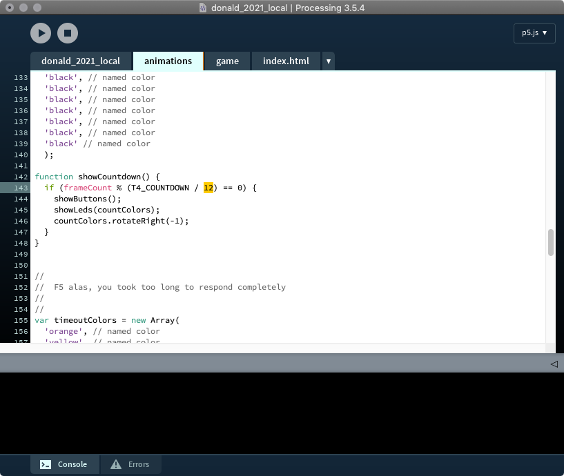

# DONALD 2021 LOCAL

&copy; 2021 Maarten Meijer / AUAS

## Introduction

For a full description see [Full Donald 2021 on Github](https://github.com/mjmeijer/donald_2021).

This repo is the local version used by students to change and develop their own animations.

## Instructions

 - Download and install [Processing](https://processing.org).

- Run it.

 - Install the **p5js** environment. More information on [p5js here](https://p5js.org)

 - Open the file `donald_2021_local/donald_2021_local/donald_2021_local.js`

 

  - select the tab `animations.js`

## How to change the code?

  - First look at the instructions on [p5js.org](https://p5js.org/learn/) and understand how p5js works.

  - Only **after** that do you start changing the local code.

  - Start by chnaging one of the `Tx_xxxx` timing parameters in the top of the file and press run (>). See what happend. Changing the timings is changing the user interaction and usability.

  

  - Next change some of the colors using color names or RGB values. Changing the colors is mostly changing the user experience.

  

 - Finally you can change the code that takes care of the anmations. For example change the 12 into 24 or 356 nd observe what happens when you run it. Changing the colors is changing the user interaction, usability and user experience.

  

## Tips

  - Turn on the inspector in your browser. Then you can see some of the print statements.

  

# Tools

  Javascript developed using [p5js](https://p5js.org) with [Processing](https://processing.org).
